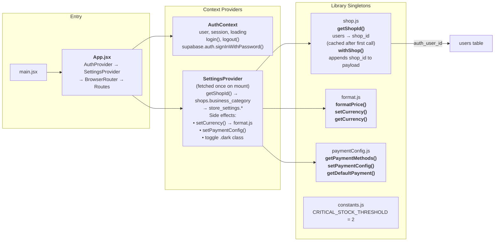
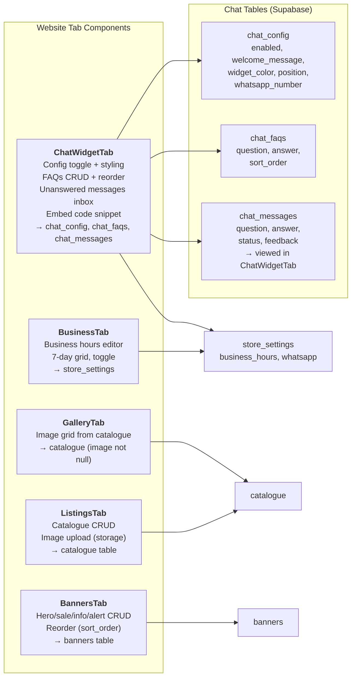
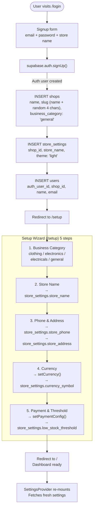
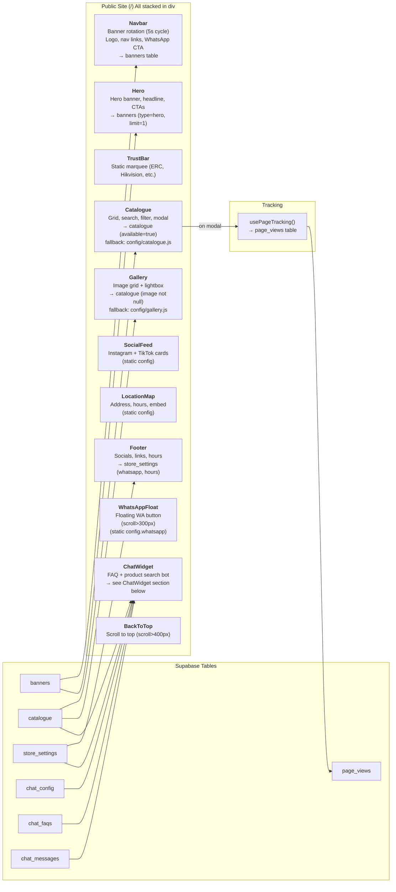
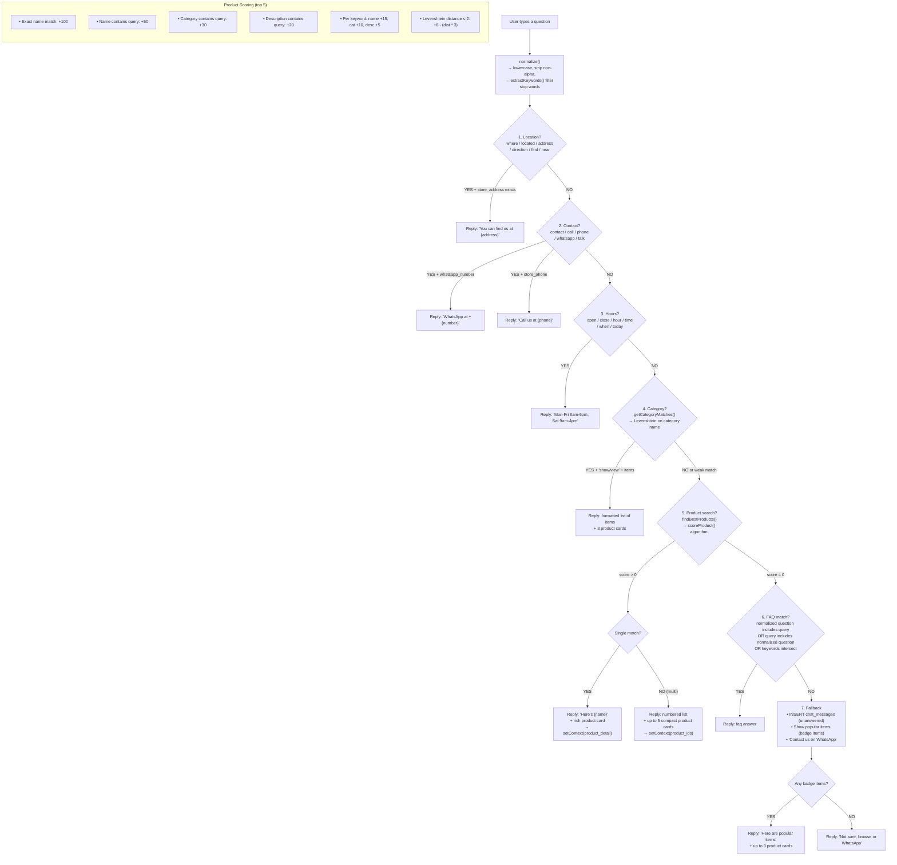
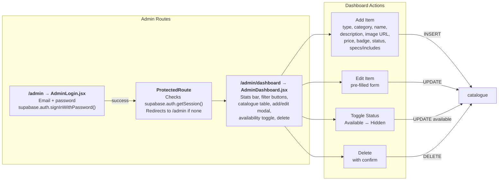
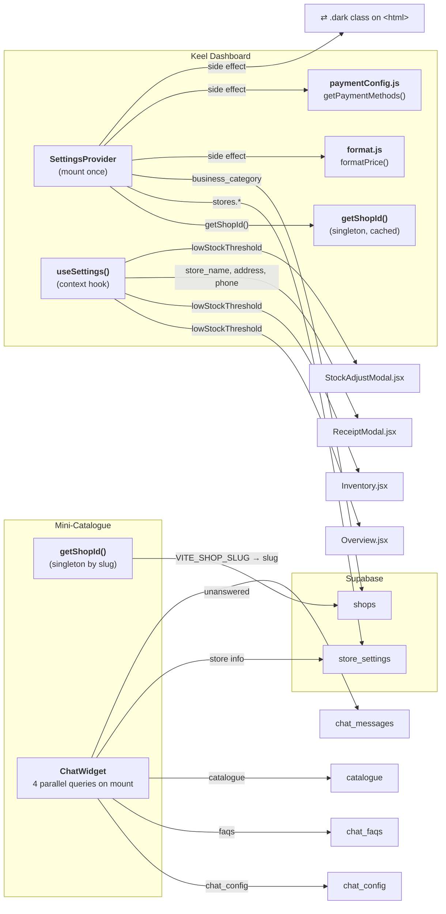

# Keel + Mini-Catalogue Architecture

## 1. Project Overview

Two React apps share one Supabase project (`yphyvahluvxddkwhevwl`):

| App | Stack | Purpose |
|---|---|---|
| **Keel** (`keel/`) | React 19, Tailwind v4, motion, react-router | Dashboard for shop owners — inventory, sales, settings, website management |
| **Mini-Catalogue** (`mini-catalogue-electricals/`) | React 19, Tailwind v4, motion, react-router | Public-facing site with product listings, chat widget, admin panel |

---

## 2. Database Tables

```mermaid
erDiagram
    shops ||--o{ store_settings : has
    shops ||--o{ products : has
    shops ||--o{ catalogue : has
    shops ||--o{ banners : has
    shops ||--o{ sales : has
    shops ||--o{ payments : has
    shops ||--o{ posts : has
    shops ||--o{ stock_movements : has
    shops ||--o{ page_views : has
    shops ||--o{ chat_config : has
    shops ||--o{ chat_faqs : has
    shops ||--o{ chat_messages : has
    shops ||--o{ users : has

    shops {
        string id PK
        string name
        string slug
        string business_category
        datetime created_at
    }

    store_settings {
        string shop_id FK
        string store_name
        string store_phone
        string store_address
        string currency_symbol
        int low_stock_threshold
        string default_payment
        string receipt_footer
        string theme
        string website_url
        string whatsapp
        string business_hours
    }

    products {
        string id PK
        string shop_id FK
        string name
        string category
        float price
        int stock
        string variants
    }

    catalogue {
        string id PK
        string shop_id FK
        string name
        string type
        string category
        float price
        string image
        bool available
        bool featured
        string variants
        string specs
        string includes
        string price_label
    }

    banners {
        string id PK
        string shop_id FK
        string type
        string title
        string subtitle
        string message
        string image_url
        bool active
        int sort_order
    }

    sales {
        string id PK
        string shop_id FK
        string product_id
        string product_name
        float amount
        int quantity
        string method
        datetime created_at
    }

    payments {
        string id PK
        string shop_id FK
        string invoice_id
        string provider
        float amount
        string status
    }

    posts {
        string id PK
        string shop_id FK
        string platform
        string caption
        string status
        datetime scheduled_at
    }

    stock_movements {
        string id PK
        string shop_id FK
        string product_id
        string product_name
        int change
        string reason
    }

    page_views {
        string id PK
        string shop_id FK
        string page
        string product_name
        string referrer
        string user_agent
    }

    users {
        string id PK
        string auth_user_id FK
        string shop_id FK
        string name
        string email
    }

    chat_config {
        string shop_id PK FK
        bool enabled
        string welcome_message
        string widget_color
        string position
        string whatsapp_number
    }

    chat_faqs {
        string id PK
        string shop_id FK
        string question
        string answer
        int sort_order
    }

    chat_messages {
        int id PK
        string shop_id FK
        string question
        string answer
        string customer_name
        string status
        string feedback
        datetime created_at
    }
```

---

## 3. Keel Dashboard — App Shell & Auth



---

## 4. Keel Dashboard — Routes & Pages

```mermaid
flowchart LR
    subgraph ProtectedRoutes["Protected Routes (React.lazy)"]
        direction TB
        ROOT["<b>/ → Overview.jsx</b><br/>eager import<br/>StatCards, WeeklySalesChart,<br/>TopProducts, SlowMovingStock,<br/>PageViewsChart (mock), TourGuide"]
        INV["<b>/inventory → Inventory.jsx</b><br/>Product CRUD, search,<br/>publish/unpublish,<br/>stock adjust modal"]
        SALES["<b>/sales → Sales.jsx</b><br/>Sales list, search,<br/>log sale, receipt modal"]
        SOC["<b>/social → Social.jsx</b><br/>Post scheduler,<br/>Instagram stats"]
        BOTS["<b>/bots → Bots.jsx</b><br/>WA + Telegram cards<br/>(static)"]
        WEB["<b>/website → Website.jsx</b><br/>Tabbed container"]
        SET["<b>/settings → Settings.jsx</b><br/>All store settings,<br/>theme, export"]
        PROF["<b>/profile → Profile.jsx</b><br/>Info display, logout"]
        STOCK["<b>/stock-history → StockHistory.jsx</b><br/>Stock movement log"]
    end

    subgraph PublicRoutes["Public Routes"]
        LOGIN["<b>/login → Login.jsx</b><br/>Login + signup flow<br/>Signup creates: shop + settings + users row"]
        SETUP["<b>/setup → SetupWizard.jsx</b><br/>Onboarding: category →<br/>store → currency →<br/>payment → threshold"]
    end

    subgraph Layout["Layout (PageLayout)"]
        SB["Sidebar<br/>Nav links, low stock badge,<br/>store name initial"]
        TB["Topbar<br/>Search, bell notifications,<br/>profile dropdown, logout"]
    end

    Layout --> ProtectedRoutes
    ProtectedRoutes -->|"every query"| SID["shop.js<br/>getShopId()"]
    PublicRoutes -.->|"no layout"| LOGIN
    PublicRoutes -.->|"no layout"| SETUP
```



---

## 5. Keel Dashboard — Website Tab Components



---

## 6. Keel Dashboard — Signup & Setup Flow



---

## 7. Mini-Catalogue — Public Site Components



---

## 8. ChatWidget — Intent Pipeline (Rule-Based, No AI)



---

## 9. Mini-Catalogue — Admin Panel



---

## 10. Data Flow Summary



---

## 11. Component Dependencies & Imports

```mermaid
graph TB
    APP["App.jsx"] --> AUTH["AuthContext"]
    APP --> SETTINGS_PROV["SettingsProvider"]
    APP --> ROUTER["BrowserRouter"]

    SETTINGS_PROV --> SID["shop.js (getShopId)"]
    SETTINGS_PROV --> FMT["format.js (setCurrency)"]
    SETTINGS_PROV --> PCFG["paymentConfig.js (setPaymentConfig)"]

    INV["Inventory.jsx"] --> APM["AddProductModal"]
    INV --> EPM["EditProductModal"]
    INV --> SAM["StockAdjustModal"]
    INV --> BADGE["Badge"]
    INV --> SETTINGS_CTX["useSettings()"]

    SALES["Sales.jsx"] --> LSM["LogSaleModal"]
    SALES --> RM["ReceiptModal"]
    SALES --> BADGE
    RM --> SETTINGS_CTX
    RM --> FMT
    LSM --> PCFG

    WEB["Website.jsx"] --> LIST["ListingsTab"]
    WEB --> BAN["BannersTab"]
    WEB --> BUS["BusinessTab"]
    WEB --> GAL["GalleryTab"]
    WEB --> CHAT["ChatWidgetTab"]
    LIST --> IMG_UPLD["ImageUploader"]
    LIST --> FMT
    APM --> IMG_UPLD
    EPM --> IMG_UPLD

    OVER["Overview.jsx"] --> SC["StatCard"]
    OVER --> WSC["WeeklySalesChart"]
    OVER --> TP["TopProducts"]
    OVER --> SMS["SlowMovingStock"]
    OVER --> PWC["PageViewsChart"]
    OVER --> MVP["MostViewedPages"]
    OVER --> TS["TrafficSources"]
    OVER --> TG["TourGuide"]
    OVER --> SETTINGS_CTX

    SID["shop.js"] -->|"auth user → shop_id"| USERS["users table"]
```



---

## 12. Full File Tree

```
keel/
├── src/
│   ├── main.jsx                          # Entry point
│   ├── App.jsx                           # Providers + routing
│   ├── context/
│   │   ├── AuthContext.jsx                # user, session, login, logout
│   │   ├── SettingsProvider.jsx           # Fetch + apply settings
│   │   └── settingsContext.js             # Context definition
│   ├── hooks/
│   │   ├── useSettings.js                 # useContext(SettingsContext)
│   │   └── useDebounce.js                 # Debounce hook
│   ├── lib/
│   │   ├── supabase.js                    # Supabase client
│   │   ├── shop.js                        # getShopId(), withShop()
│   │   ├── format.js                      # formatPrice(), setCurrency()
│   │   ├── constants.js                   # CRITICAL_STOCK_THRESHOLD
│   │   ├── paymentConfig.js               # getPaymentMethods(), setPaymentConfig()
│   │   └── storage.js                     # Image upload/delete
│   ├── payment/
│   │   ├── index.js                       # Re-exports
│   │   ├── IntaSendCheckout.jsx           # M-Pesa checkout
│   │   └── usePayment.js                  # Sale + payment + stock tracking
│   ├── pages/
│   │   ├── Overview.jsx                   # Dashboard KPIs
│   │   ├── Inventory.jsx                  # Products CRUD
│   │   ├── Sales.jsx                      # Sales log
│   │   ├── Social.jsx                     # Post scheduler
│   │   ├── Bots.jsx                       # Bot cards
│   │   ├── Website.jsx                    # Tabbed website mgmt
│   │   ├── Settings.jsx                   # All settings
│   │   ├── Profile.jsx                    # Info display
│   │   ├── Login.jsx                      # Auth + signup
│   │   ├── SetupWizard.jsx                # Onboarding
│   │   └── StockHistory.jsx               # Stock log
│   └── components/
│       ├── layout/
│       │   ├── PageLayout.jsx             # Sidebar + Topbar + content
│       │   ├── Sidebar.jsx                # Navigation
│       │   └── Topbar.jsx                 # Search, notifications, profile
│       ├── website/
│       │   ├── ListingsTab.jsx            # Catalogue CRUD
│       │   ├── BannersTab.jsx             # Banner CRUD
│       │   ├── BusinessTab.jsx            # Hours editor
│       │   ├── GalleryTab.jsx             # Image gallery
│       │   └── ChatWidgetTab.jsx          # Widget config + FAQs + inbox
│       ├── Badge.jsx                      # Stock badge
│       ├── StatCard.jsx                   # KPI card
│       ├── Skeleton.jsx                   # Loading skeleton
│       ├── TopProducts.jsx                # Bar chart
│       ├── WeeklySalesChart.jsx           # Recharts chart
│       ├── SlowMovingStock.jsx            # Slow stock table
│       ├── MostViewedPages.jsx            # Mock analytics
│       ├── PageViewsChart.jsx             # Mock chart
│       ├── TrafficSources.jsx             # Mock sources
│       ├── TourGuide.jsx                  # Onboarding tour
│       ├── AddProductModal.jsx            # Add product form
│       ├── EditProductModal.jsx           # Edit product form
│       ├── StockAdjustModal.jsx           # Adjust stock
│       ├── LogSaleModal.jsx               # Log sale form
│       ├── ReceiptModal.jsx               # Receipt view
│       ├── PlanPostModal.jsx              # Schedule post
│       └── ImageUploader.jsx              # Drag & drop upload
└── docs/
    └── architecture.md                    # This file

mini-catalogue-electricals/
├── src/
│   ├── App.jsx                            # Routes + layout
│   ├── lib/
│   │   ├── supabase.js                    # Supabase client
│   │   └── shop.js                        # getShopId() by slug
│   ├── hooks/
│   │   └── usePageTracking.js             # page_views tracking
│   ├── config/
│   │   ├── shop.js                        # Static shop config
│   │   ├── catalogue.js                   # Fallback products
│   │   └── gallery.js                     # Fallback images
│   ├── admin/
│   │   ├── AdminLogin.jsx                 # Auth form
│   │   ├── ProtectedRoute.jsx             # Session guard
│   │   └── AdminDashboard.jsx             # Catalogue CRUD
│   └── components/
│       ├── Navbar.jsx                     # Header + banners
│       ├── Hero.jsx                       # Hero section
│       ├── TrustBar.jsx                   # Trust badges
│       ├── Catalogue.jsx                  # Product grid
│       ├── CatalogueCard.jsx              # Product card
│       ├── CatalogueModal.jsx             # Product detail
│       ├── SearchBar.jsx                  # Search input
│       ├── Gallery.jsx                    # Image grid
│       ├── SocialFeed.jsx                 # Social cards
│       ├── LocationMap.jsx                # Map + address
│       ├── Footer.jsx                     # Footer
│       ├── WhatsAppFloat.jsx              # Floating WA
│       ├── ChatWidget.jsx                 # Rule-based chat
│       ├── AnnouncementBar.jsx            # Standalone (unused)
│       └── BackToTop.jsx                  # Scroll to top
└── public/
    └── ...
```
