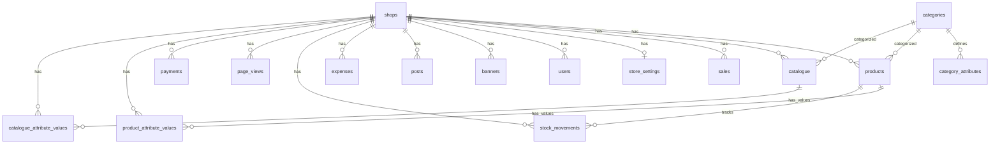

# Database Schema

## Overview

Single Supabase Postgres database shared by all shops. Multi-tenancy via `shop_id` FK on every user-data table.

## Entity-Relationship Diagram

## Tables

### `shops`
| Column | Type | Notes |
|---|---|---|
| id | uuid | PK |
| name | text | |
| slug | text | Unique, used for shop routing |
| business_category | text | Matches categories.slug |
| created_at | timestamptz | |

### `users`
| Column | Type | Notes |
|---|---|---|
| id | uuid | PK |
| auth_user_id | uuid | Supabase Auth user ID |
| shop_id | uuid | FK → shops |
| name | text | |
| email | text | |
| created_at | timestamptz | |

### `products`
| Column | Type | Notes |
|---|---|---|
| id | uuid | PK |
| shop_id | uuid | FK → shops |
| name | text | |
| category | text | |
| price | numeric | |
| stock | integer | |
| cost_price | numeric | For profit calculation |
| barcode | text | Used for scanning |
| variants | jsonb | Legacy, unused by UI |
| image | text | URL |
| created_at | timestamptz | |

### `catalogue`
| Column | Type | Notes |
|---|---|---|
| id | uuid | PK |
| shop_id | uuid | FK → shops |
| name | text | |
| category | text | |
| type | text | "product" or "service" |
| price | numeric | |
| image | text | URL |
| available | boolean | |
| featured | boolean | |
| variants | jsonb | Legacy, unused by UI |
| specs | jsonb | Product specifications |
| includes | jsonb | What's included (for services) |
| created_at | timestamptz | |

### `store_settings`
| Column | Type | Notes |
|---|---|---|
| shop_id | uuid | PK, FK → shops |
| store_name | text | |
| store_phone | text | |
| store_address | text | |
| currency_symbol | text | Default: "KSh" |
| low_stock_threshold | integer | Default: 10 |
| default_payment | text | |
| receipt_footer | text | |
| theme | text | "light" or "dark" |
| website_url | text | Used for mini-catalogue routing |
| whatsapp | text | |
| business_hours | jsonb | |
| payment_methods | jsonb | Array of payment method objects |
| created_at | timestamptz | |
| updated_at | timestamptz | |

### `sales`
| Column | Type | Notes |
|---|---|---|
| id | uuid | PK |
| shop_id | uuid | FK → shops |
| product_id | uuid | FK → products |
| product_name | text | Denormalized for history |
| amount | numeric | |
| quantity | integer | |
| method | text | Payment method |
| created_at | timestamptz | |

### `categories`
| Column | Type | Notes |
|---|---|---|
| id | uuid | PK |
| name | text | Display name (e.g. "Clothing") |
| slug | text | Unique, matches shops.business_category |
| created_at | timestamptz | |

### `category_attributes`
| Column | Type | Notes |
|---|---|---|
| id | uuid | PK |
| category_id | uuid | FK → categories |
| name | text | e.g. "Size", "Color" |
| type | text | "select", "text", "number" |
| options | jsonb | Array for "select" type |
| required | boolean | |
| sort_order | integer | Display order |

### `product_attribute_values`
| Column | Type | Notes |
|---|---|---|
| id | uuid | PK |
| product_id | uuid | FK → products |
| attribute_id | uuid | FK → category_attributes |
| value | text | |
| shop_id | uuid | FK → shops |
| UNIQUE(product_id, attribute_id) | | |

### `catalogue_attribute_values`
Same as `product_attribute_values` but for catalogue items.

### Other Tables

`banners`, `payments`, `posts`, `expenses`, `stock_movements`, `page_views` — all follow the same pattern with `id` (uuid PK), `shop_id` (FK), relevant data columns, and `created_at`.
